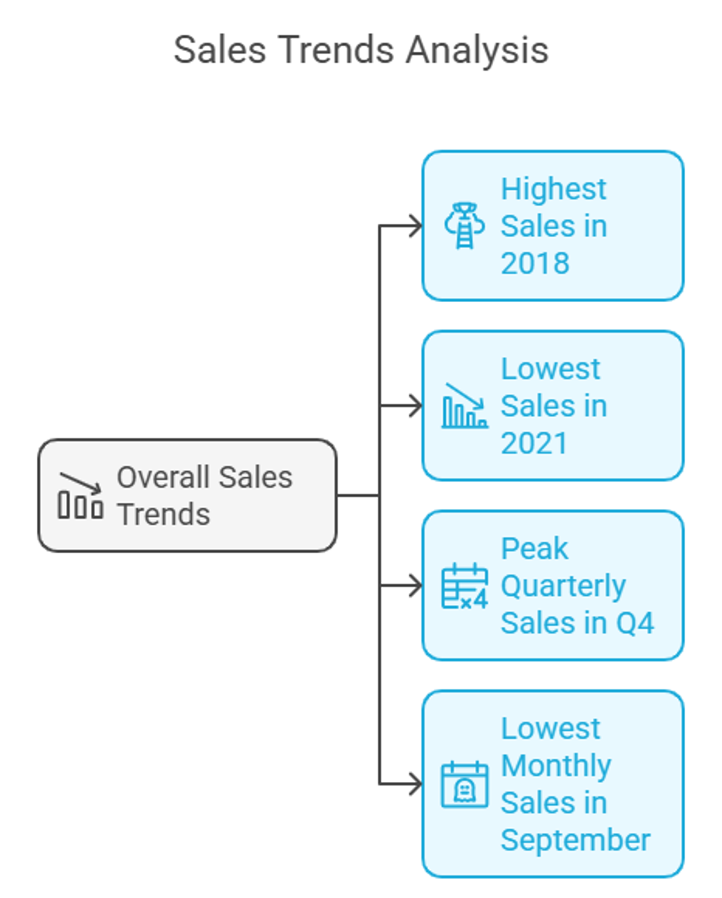
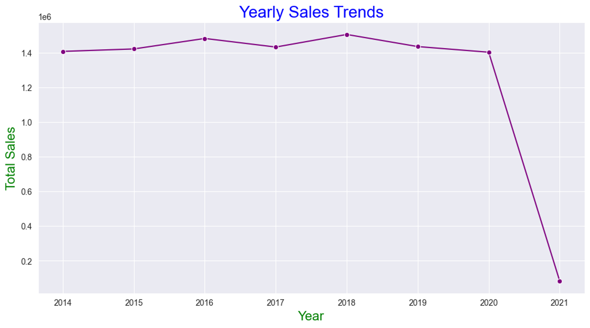
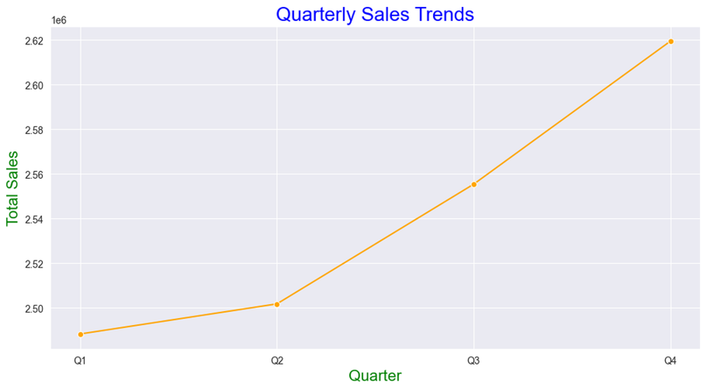
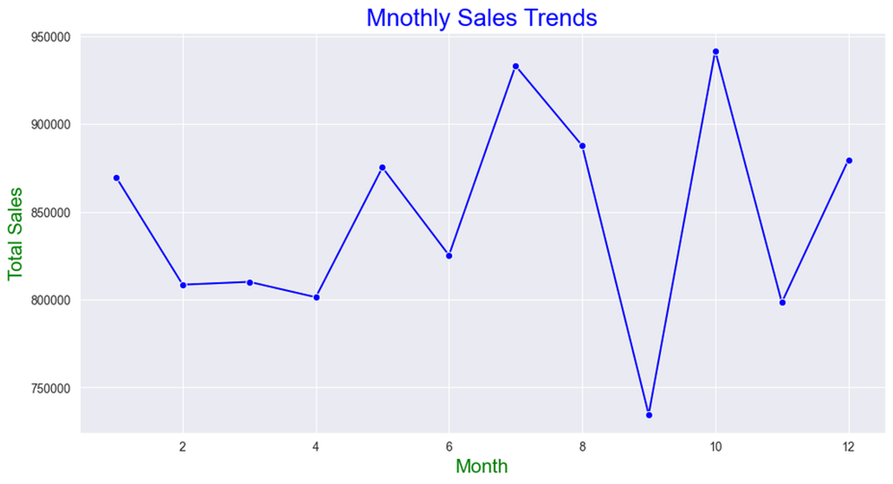
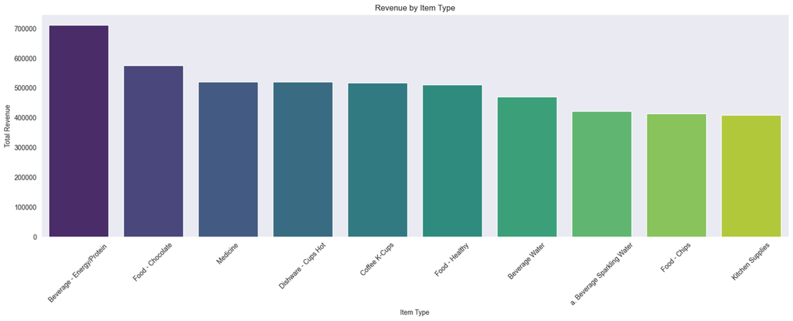
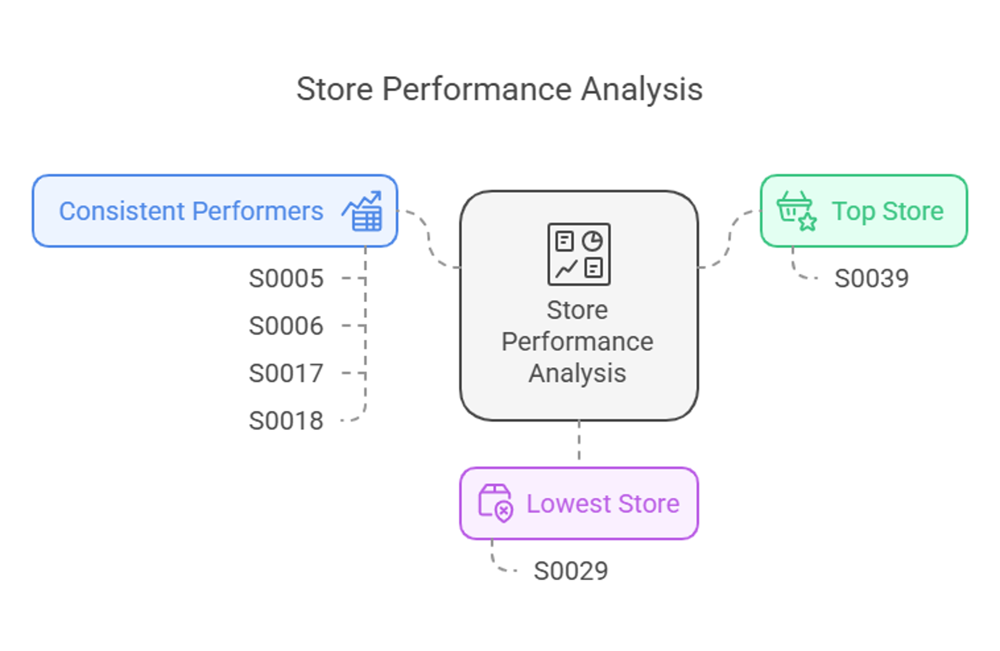
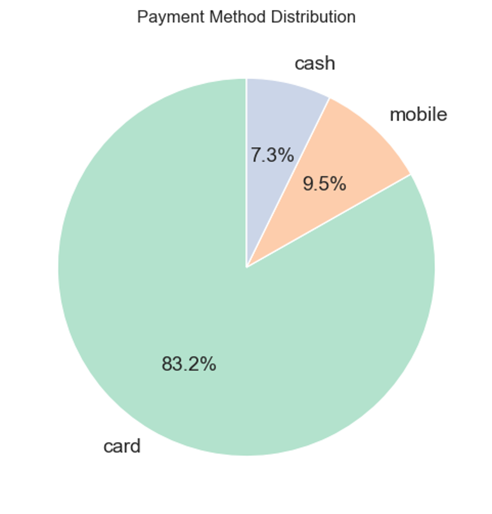

# Supply and Sales Management with Business Intelligence | Case Study | Python

# Introduction
> Business Intelligence (BI) enhances decision-making in supply and sales management.

> Helps optimize inventory, forecast demand, and analyze customer behavior.

> Objective: Improve business performance using data-driven strategies.

---

# Research Objectives

- Identify key sales and supply chain trends.
  
- Develop predictive models for sales forecasting.
  
- Provide recommendations for inventory management and customer targeting.
  
- Assess the impact of BI-driven strategies.

---

# Methodology

* Data Collection: Sales transactions, inventory levels, customer behavior, 
        and store performance.

- Analytical Techniques:
  - Descriptive Analytics: Identifying trends.
   
  - Predictive Analytics: Forecasting future sales.
    
  - Prescriptive Analytics: Recommending actions.

- Tools Used: Python (Pandas, Matplotlib, Scikit-learn).

---

# Key Findings – Sales Trends

- Highest sales in 2018 (Strong business performance).
  
- Lowest sales in 2021 (Incomplete data for the year).
  
- Peak quarterly sales in Q4 due to holiday demand.
  
- Lowest monthly sales in September.

---

# Yearly Sales Trend

- 1. Highest Sales in 2018: 2018 had the highest sales, showing a strong performance throughout the year.
     
- 2. Lowest Sales in 2021: 2021 has the lowest sales, but this is because only one month of sales data is available. So, the sales numbers for 2021 are not complete.

---

# Quarterly Sales Trend

- 1. Highest Sales: Q4 had the highest sales, showing strong year-end performance.
     
- 2. Lowest Sales: Q1 had the lowest sales, likely due to slower activity at the year's start.
  
- 4. Overall Trend: Sales followed an upward trend throughout the year.

---

# Monthly Sales Trend

- 1. Highest Sales Month: October had the highest sales, indicating peak performance during this month.
     
- 2. Lowest Sales Month: September had the lowest sales, possibly due to lower market demand.
     
- 3. Seasonal Trends: Sales fluctuated throughout the year, with notable increases in mid and late months (e.g., July, October).

---

# Top 10 Item Insights

- Beverage - Energy/Protein drinks and Chocolate bring in the most revenue.
  
- Most other items bring in similar amounts, while Kitchen Supplies have the lowest revenue.

---

# Store Performance

- Top Store: S0039 (Highest revenue).
  
- Lowest Store: S0029 (Possible location-based issues).
  
- Consistent Performers: S0005, S0006, S0017, S0018

---

# Customer Behavior Analysis

- Top Customer: Pooja (Highest purchase value).
  
- Most Popular Products: Beverages, chocolates, energy drinks.
  
- Payment Trends:
  
  - Card Payments: 83.2%
    
  - Mobile Payments: 9.5% (Growing trend).
    
  - Cash Transactions: 7.3% (Declining).

---

# Predictive & Prescriptive Analysis

- Overall Dataset:
  
  - Predictive Model Accuracy: 89.7% (R² score).
- Assigned Task:
  
  - Predictive Model Accuracy: 97.2% (R² score). This is excellent accuracy!
    
  - Key Variables Influencing Sales: Store location, product type, seasonality.
- Recommendations:
  
  - Improve inventory planning.
    
  - Target low-demand periods with promotions.
    
  - Expand successful store locations.
    
  - Encourage digital payments.

---

# Conclusion & Future Scope

- BI improves supply chain and sales efficiency.
  
- Helps businesses make data-driven decisions.
- Future research:
  - AI-powered real-time analytics.
    
  - Deep learning for advanced forecasting.
    
  - Geospatial analysis for store performance.

---

## 🧑‍💻 Created by

**Nazrul Islam**  
📍 Data & Business Analyst  
📧 [nazrul.contact007@gmail.com](mailto:nazrul.contact007@gmail.com)

---

## 🌐 Let's Connect

- [LinkedIn](https://www.linkedin.com/in/nazrul-islam45)
- [Portfolio Website](https://your-portfolio-site.com)  

---

> ⭐ *If you found this project helpful or inspiring, feel free to star the repository and connect with me on LinkedIn!*

